```{r setup, include = FALSE}
knitr::opts_chunk$set(
  collapse = TRUE,
  comment = "#>"
)
```

# Classify spreadsheets

It might be useful to automatically classify spreadsheets that are published on
Data.Gov.UK, to assist in finding data in the desired form (raw data, summary
tables, interactive calculations).  It might also help prioritise revision of
spreadsheets that fall short of best practice for given uses and users.

# Data

A sample of spreadsheets from Data.Gov.UK would be great, but they don't seem to
be centrally hosted, so I've asked the team on slack (#datagovuk) whether
there's a way to access them in bulk.

> Hello, I'm doing some experimental analysis of government spreadsheets and
> have a couple of Qs about data.gov.uk datasets.  Is it possible to filter for
> specifically the XLSX file format (the XLS filter seems to include both .xls
> and .xlsx)?  Is there a way to access the files in bulk, or has anyone
> attempted to scrape a large sample of them before?  Is this a good place for
> these questions?

Meanwhile I'll use the [Enron
corpus](https://figshare.com/articles/Enron_Spreadsheets_and_Emails/1221767) [@hermans2015]
([via](http://www.felienne.com/archives/3634)), which I already have for testing
[tidyxl](https://nacnudus.github.io/tidyxl).

# Methods

## 1. t-SNE

t-SNE is a dimension reduction technique that Matthew Gregory used to classify
handwritten digits from the MNIST dataset.  It could be used to classify
spreadsheets by the shape of the data in them.

Why not PCA?  Because PCA keeps dissimilar points apart, whereas t-SNE keeps
similar points together.  From Matthew Gregory on [Machine
Gurning](http://www.machinegurning.com/rstats/tsne/):

> The aim of dimensionality reduction is to preserve as much of the significant
> structure of the high-dimensional data as possible in the low-dimensional map.
> Rather than keeping dissimiliar data points apart (like linear methods i.e.
> PCA), t-SNE keeps the low-dimensional representations of very similar
> datapoints close together on a low-dimensional, non-linear manifold (the map).

### Resolution

Not all spreadsheets have the same 'resolution' (use the same number of cells
along each dimensions).  It might not be _that_ important, because not all
digits in the MNIST data are written at the same size (but the images are all
the same size).  Options:

1. Down/upsample to standardise the resolution
2. Only examine part of each spreadsheet.  Whatever fits on a screen is usually
   enough for a human at first glance to feel that sinking feeling.  On my
   screen, that is the range `A1:Z42` on a blank sheet, but in the end I used
   a 25 by 25 square, `A1:Y25`.

```{r}
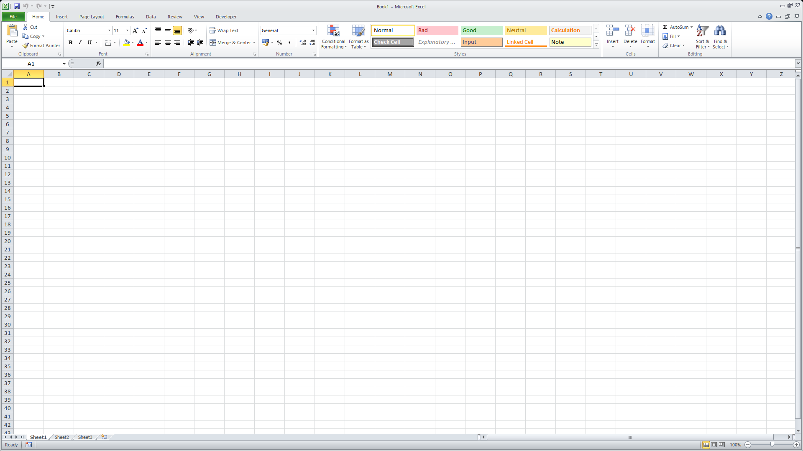
```

Because t-SNE is so computationally expensive, it's a good idea to either avoid
high resolution altogether, or to make a first pass with PCA.  Via
[@luckylwk](https://medium.com/@luckylwk/visualising-high-dimensional-datasets-using-pca-and-t-sne-in-python-8ef87e7915b):

> one of the recommendations is that, in case of very high dimensional data, you
> may need to apply another dimensionality reduction technique before using
> t-SNE:

And, from the [original
paper](http://jmlr.org/papers/volume9/vandermaaten08a/vandermaaten08a.pdf):

> It is highly recommended to use another dimensionality reduction method (e.g.
> PCA for dense data or TruncatedSVD for sparse data) to reduce the number of
> dimensions to a reasonable amount (e.g. 50) if the number of features is very
> high.

The `Rtsne` function in the `Rtsne` package does an initial PCA pass by
default.

### Method

1. Sample a reasonable number of spreadsheet files -- I used 1000, containing
   3258 separate worksheets altogether.
2. If a cell has a value, i.e. `!is_blank`, encode it as `1`, otherwise `0`.
3. Construct a matrix of cells, using `row` and `col` to determine each cell's
   position.
5. Apply PCA and explore the dimensions.
6. Apply t-SNE using Machine Gurning's method.

### Six example spreadsheets

In the graph, cells that have values are shown in red.  The view range in these
cases was 25 by 25 cells.

The screenshots below the graph show what the original spreadsheets look like.

```{r}
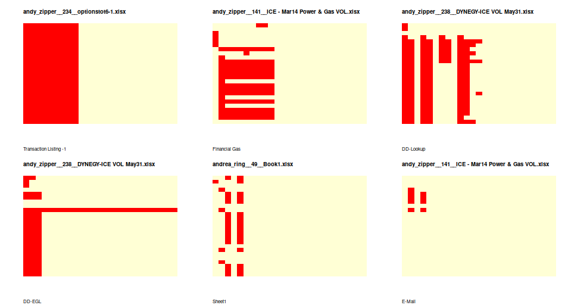
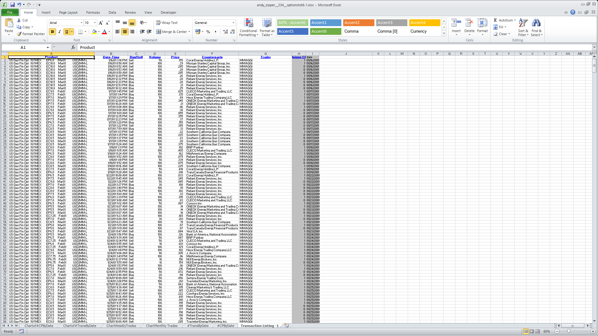
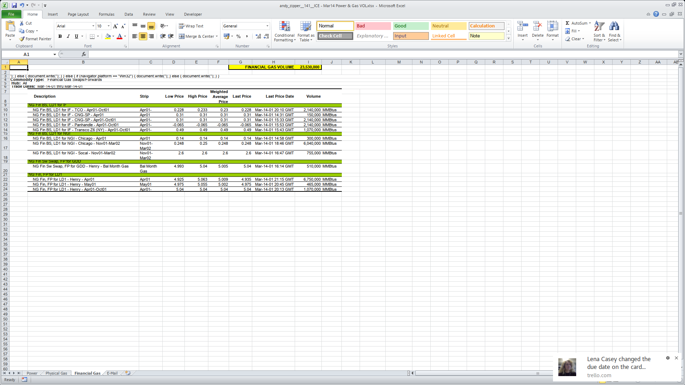
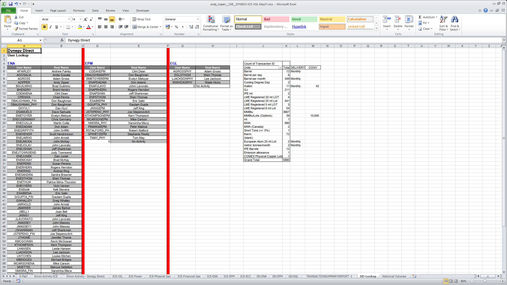
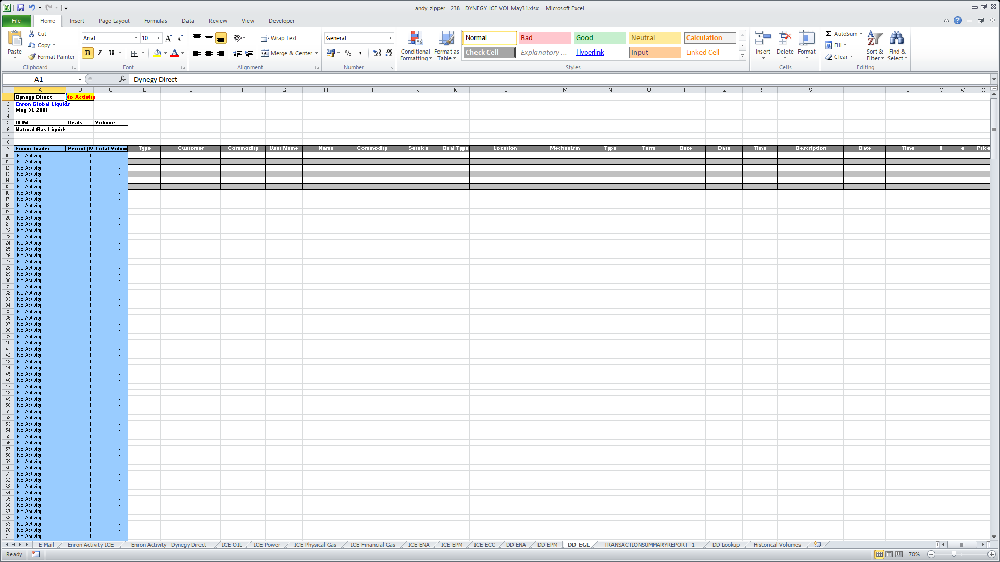
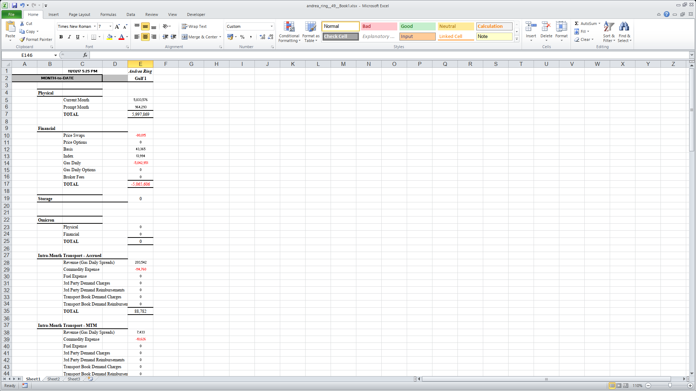
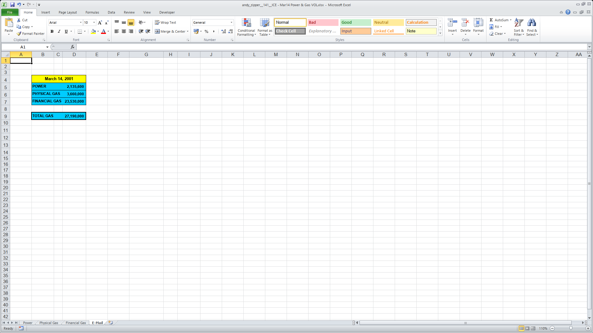
```

```{r, include = FALSE}
# 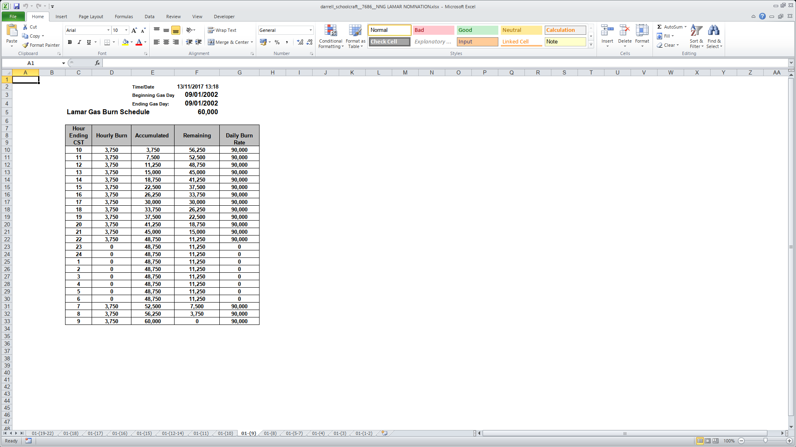
# 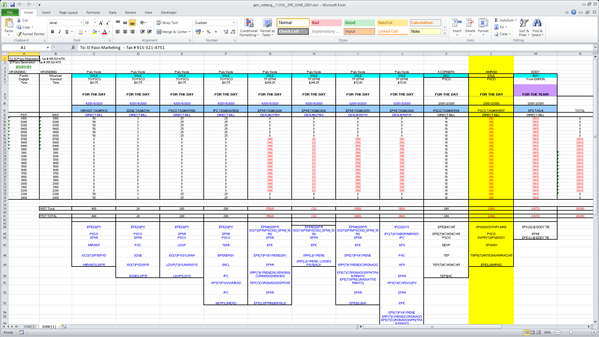
# 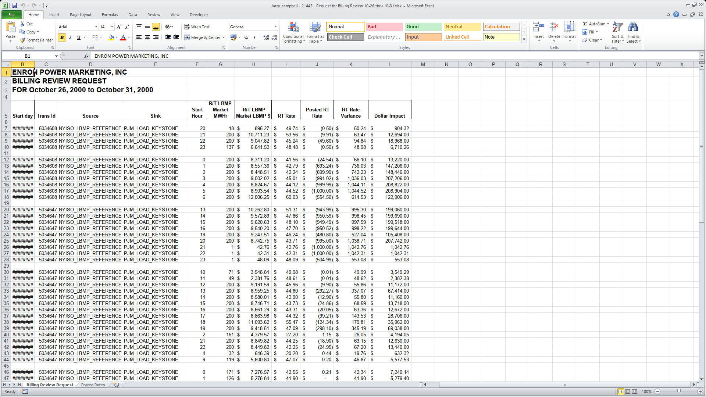
# 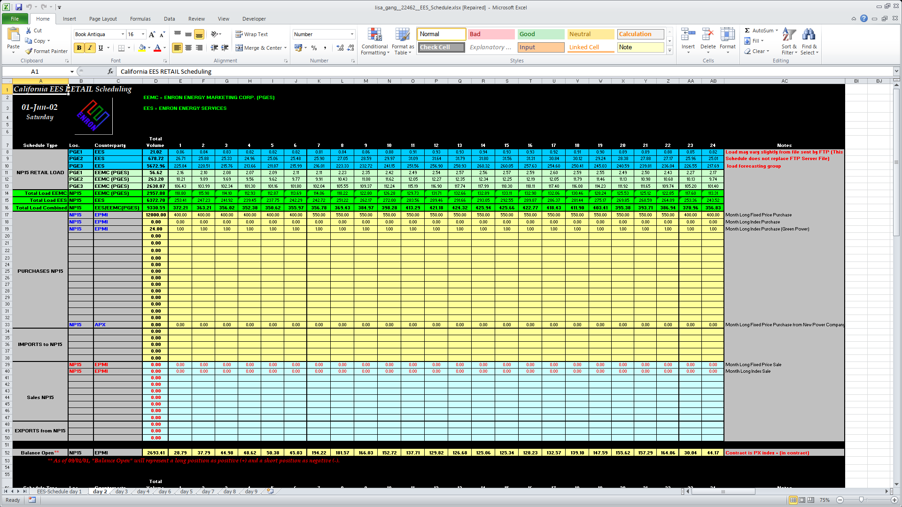
# 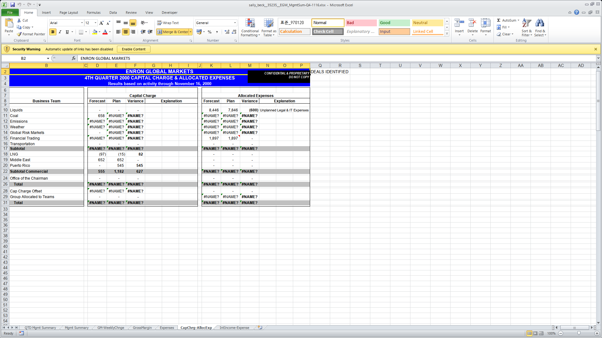
# 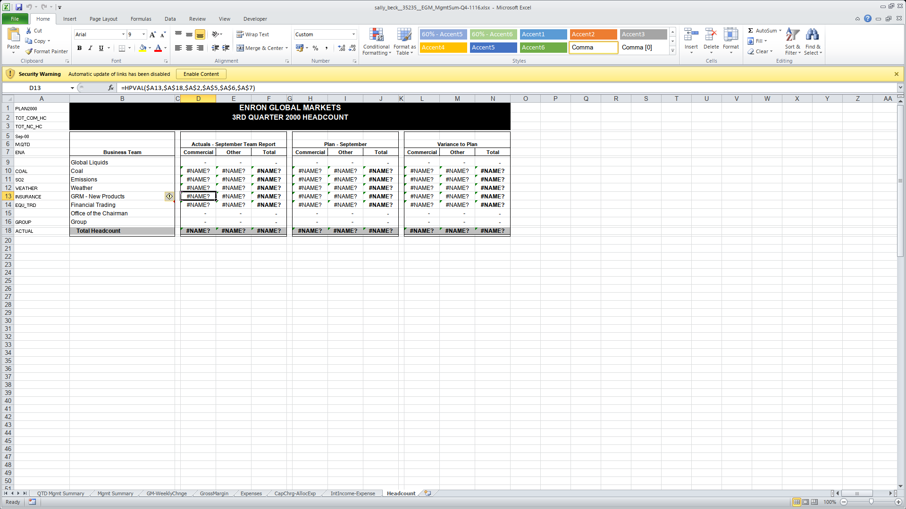
```

### PCA

The PCA identifies one crucial dimension, and several less important but still
valuable ones.

`r knitr::include_graphics("fviz_eig.png")`

Individual sheets are not influential.

`r knitr::include_graphics("fviz_contrib_ind.png")`

The patterns of influential cells across different dimensions are interesting.
First it looks for cells generally towards the middle and bottom right, then it
looks to the left and right edges, then specifically the top few rows.
Eventually it gets to more detail, but this is harder to interpret.  Column 7 is
particularly influential on the fifth dimension -- seems a little odd.

`r knitr::include_graphics("cell_contributions.png")`

The scattergraph suggests many sheets that are similar in the first dimension
are also similar in the second.

`r knitr::include_graphics("fviz_pca_ind.png")`

Here are the sheets at the extremes of the first two dimensions.

#### Dim 1 low
`r knitr::include_graphics("extreme-dim1-low-joe_stepenovitch__15114.png")`

#### Dim 1 high
`r knitr::include_graphics("extreme-dim1-high-darrell_schoolcraft__7735.png")`

#### Dim 2 high
`r knitr::include_graphics("extreme-dim2-low-joe_stepenovitch__15114_results.png")`

#### Dim 2 high
`r knitr::include_graphics("extreme-dim2-high-rick_buy__23729.png")`

### t-SNE

Applyin t-SNE, the cloud does not show as clear a pattern as the PCA.

`r knitr::include_graphics("tsne-1000.png")`

# Resources

* [t-Distributed Stochastic Neighbor
  Embedding](http://www.machinegurning.com/rstats/tsne/)
* [Visualising high-dimensional datasets using PCA and t-SNE in
  Python](https://medium.com/@luckylwk/visualising-high-dimensional-datasets-using-pca-and-t-sne-in-python-8ef87e7915b)

# References
